# STATION_MAP.md — KITTY / VXStation Source Map

> Generated from full codebase read. Operational reference — not commentary.

## Module Index

### 1. shared/ (7 files) — Foundation types

| File | Exports | Consumers |
|------|---------|-----------|
| `error.types.ts` | `TerminalError`, `TerminalErrorCode` | policy, registry, dispatch, shell |
| `ids.ts` | `makeRequestId()`, `makeCorrelationId()` | command-bus, shell |
| `module.contract.ts` | `TerminalModule`, `RequestedCommand` | registry, wrappers |
| `module.host.ts` | `ModuleHost` | wrappers |
| `module.types.ts` | `ModuleName`, `ModuleCapability`, `ModuleManifest`, `ModuleHealth` | registry, policy, shell |
| `result.types.ts` | `ResultEnvelope<T>` | command-bus, wrappers, shell |
| `terminal.types.ts` | `SessionContext`, `ModuleRequest` | shell, wrappers, registry |

### 2. evidence/ (6 files) — Hash chain, sinks, writer

| File | Exports | Depends on |
|------|---------|------------|
| `evidence.types.ts` | `EvidenceSink`, `ImmutableEvidenceSink` | — |
| `hash-chain.ts` | `appendToChain()`, `verifyChain()`, `readChainHead()`, `GENESIS_HASH` | `evidence.types` |
| `jsonl.sink.ts` | `JsonlEvidenceSink` | `evidence.types` |
| `evidence.writer.ts` | `EvidenceWriter` | `hash-chain`, `evidence.types` |
| `evidence.layer.ts` | `EvidenceLayer` | `evidence.writer`, `jsonl.sink`, `hash-chain` |
| `index.ts` | barrel re-export | all above |

**Env deps:** `KITTY_ROOT`, `KITTY_HASH_HEAD`, `KITTY_COMMAND_AUDIT_FILE`
**Atomic write:** write-tmp-rename via `${file}.${pid}.${Date.now()}.tmp`

### 3. policy/ (5 files) — Command/route/capability policy

| File | Exports | Depends on |
|------|---------|------------|
| `deny-reasons.ts` | `DenyReasons` (14 const codes) | — |
| `capability.policy.ts` | `CapabilityPolicy` | `shared/module.types` |
| `route.policy.ts` | `RoutePolicy` | `deny-reasons` |
| `command.policy.ts` | `CommandPolicy` | `route.policy`, `command-bus/no-direct-exec.guard` |
| `terminal.policy.ts` | `TerminalPolicy` | `capability.policy`, `command.policy` |

**Allowed route targets:** `vxstation.`, `terminal.`, `vyrdx.boundary.request`

### 4. bridge/ (11 files) — Node topology, trust, handshake

| File | Exports | Depends on |
|------|---------|------------|
| `bridge.types.ts` | `BridgeNode`, `NodeCapabilities`, `BridgeRequest`, `TrustLevel` | — |
| `node.registry.ts` | `NodeRegistry` | `bridge.types` |
| `node.handshake.ts` | `NodeHandshake` | `bridge.types` |
| `node.heartbeat.ts` | `NodeHeartbeat` | `bridge.types`, `node.registry` |
| `bridge.resolver.ts` | `BridgeResolver`, `BridgeResolution` | `bridge.types`, `node.registry` |
| `bridge.policy.ts` | `BridgePolicy` | `bridge.types` |
| `topology.types.ts` | `TopologyFile` | — |
| `topology.loader.ts` | `TopologyLoader` | `topology.types`, `bridge.types` |
| `bridge.request.ts` | `createBridgeRequest()` | `bridge.types` |
| `node.bootstrap.ts` | `bootstrapFromFile()` | `topology.loader`, `node.registry` |
| `index.ts` | barrel | all above |

**Env deps:** `KITTY_ROOT`

### 5. command-bus/ (14 files) — The heart of command processing

| File | Exports | Depends on |
|------|---------|------------|
| `command.types.ts` | `SafeCommand`, `CommandReceipt`, `CommandEnvelope`, `BrainProvider`, `ReplayStatus` | — |
| `command.security.ts` | `sha256()`, `generateNonce()`, `stableStringify()`, `buildFingerprint()` | — |
| `command.backbone.ts` | `CommandBackbone` | — |
| `command.dispatcher.ts` | `CommandDispatcher` | `command.types`, `bridge/node.bootstrap` |
| `validation.layer.ts` | `ValidationLayer` | `command.types`, `command.security` |
| `replay.guard.ts` | `ReplayGuard` | `command.types`, `command.backbone` |
| `idempotency.guard.ts` | `IdempotencyGuard` | `command.types`, `command.backbone` |
| `no-direct-exec.guard.ts` | `NoDirectExecGuard` | `command.types` |
| `decision.snapshot.ts` | `buildDecisionSnapshot()` | `command.types` |
| `brain.gateway.ts` | `BrainGateway` | `command.types` (lazy import → `SZH_CENTRAL_BRAIN`) |
| `command.audit.ts` | `CommandAudit` | `command.types` |
| `gateway.ts` | `CommandGateway` | `command.bus`, `command.types` |
| `command.bus.ts` | `CommandBus` | all guards, dispatcher, brain.gateway, evidence.layer |
| `index.ts` | barrel | all above |

**Critical circular break:** `brain.gateway.ts` uses lazy `import("../SZH_CENTRAL_BRAIN/index.js")` to break circular dependency with CentralBrainRuntime.

### 6. ENGINES/ (14 files) — 70+ engine classes

| File | Classes | Category |
|------|---------|----------|
| `base.ts` | `BaseEngine` (abstract) | — |
| `types.ts` | `Engine`, `EngineCategory`, `ConnectorPort`, `TaskPayload`, `DirectivePayload` | — |
| `security/index.ts` | Blackhat, Redhat, PerimeterScan, InjectionAudit, KeyRotation, WalletAllowlist, ThreatModel, VulnScanner, AccessControl, IncidentResponse (10) | security |
| `engineering/index.ts` | EngCore, ModuleBuilder, ContractDeployer, AttestationEngine, SealEngine, HashAnchor, CodeReview, TestRunner, DependencyAudit, SchemaValidator, MigrationRunner, RefactorEngine (12) | engineering |
| `infra/index.ts` | InfraCore, CIPipeline, DockerManager, SystemdManager, NginxConfig, CloudflaredTunnel, TailscaleBridge, Healthcheck, LogCollector, SnapshotManager, RollbackEngine, CanaryDeploy (12) | infra |
| `financial/index.ts` | CfoCore, Treasury, GasOptimizer, EscrowMonitor, BurnRate, RunwayProjection, InvoiceProcessor, TaxEngine, Payroll, FinancialReporting, MultiSigOrchestrator (11) | financial |
| `director/index.ts` | DirectorCore, TaskRouter, QueueManager, CertificationPipeline, EscalationHandler, BroadcastEngine, ScheduleEngine (7) | director |
| `server/index.ts` | OpenShell, ProcessManager, FileWatcher, CronEngine, WebhookReceiver, SocketBridge, BackupEngine (7) | server |
| `interconnect/index.ts` | EventBus, DataPipe, StateSync, TriggerEngine, Transformer (5) | interconnect |
| `governance/index.ts` | ComplianceMonitor, RiskRegister, LegalHold (3) | governance |
| `ceo/index.ts` | OpsEngine, SystemEngine, PolicyEngine, TrustClosureEngine, SealReadinessEngine, CommercialEngine, MarketEngine, FeedbackAiEngine, EvidenceEngine, CampaignEngine (10 engines) + RuntimeApiServer, GatewayServer, McpRouterServer, ChatServer, VoiceServer, VectorServer, RagServer, EvidenceServer, RoomRunnerServer, ObservabilityServer (10 servers) = **20 classes** | CEO layer |
| `ceo/conductor.ts` | `CeoConductor` + 7 workflows (full_station_audit, security_sweep, commercial_review, market_analysis, evidence_integrity, campaign_status, trust_closure_audit) | CEO |
| `index.ts` | `bootAllEngines()`, `getEngineCount()` — collects all 67 non-CEO engines into a Map | aggregator |
| `boot.ts` | `bootStation()` — wires 9 groups + CEO + conductor + interconnects → `StationBootResult` | entrypoint |

**Total engine classes:** 67 (groups) + 20 (CEO) + 1 (conductor) = **88 classes**

**CEO engine layers:** ops → system → policy → trust_closure → seal_readiness → commercial → market → feedback_ai → evidence → campaign
**CEO server layers:** runtime-api → gateway → mcp-router → chat → voice → vector → rag → evidence → room-runner → observability

### 7. SZH_CENTRAL_BRAIN/ (6 files) — Brain runtime

| File | Exports |
|------|---------|
| `index.ts` | `CentralBrainRuntime`, `centralBrainRuntime` (singleton), `CentralBrainDispatchResult` |
| `cross_room_coordination/index.ts` | `CROSS_ROOM_COORDINATION_TARGETS`, `buildCrossRoomCoordinationInput()` |
| `decision_support/index.ts` | `DECISION_SUPPORT_TARGETS`, `buildDecisionSupportInput()` |
| `orchestration_logic/index.ts` | `ORCHESTRATION_LOGIC_TARGETS`, `buildOrchestrationLogicInput()` |
| `policy_routing/index.ts` | `POLICY_ROUTING_TARGETS`, `buildPolicyRoutingInput()` |
| `state_synthesis/index.ts` | `STATE_SYNTHESIS_TARGETS`, `buildStateSynthesisInput()` |

**CentralBrainRuntime.dispatch():** target → `vxstation.brain.<target>` → `LOCAL_TARGET_BINDINGS` → CEO engine layer → execute.

### 8. shell/ (6 files) — Terminal tower shell

| File | Exports | Depends on |
|------|---------|------------|
| `event.stream.ts` | `EventStream`, `TowerEvent` | `wrappers/event.wrapper` |
| `hotkey.controller.ts` | `HotkeyController`, `HotkeyBinding` | — |
| `layout.controller.ts` | `LayoutController`, `LayoutLane` | — |
| `route.controller.ts` | `RouteController`, `LaneRoute` | — |
| `session.controller.ts` | `SessionController` | `shared/ids`, `shared/terminal.types` |
| `terminal.shell.ts` | `TerminalShell`, `TowerSnapshot` | registry, wrappers, policy, command-bus, shell/* |

**Env deps:** `KITTY_ROOT`, `VYRDON_TOWER_ROOT`

### 9. dispatch/ (2 files) — Command dispatch adapters

| File | Exports | Depends on |
|------|---------|------------|
| `dispatcher.ts` | `Dispatcher` | `command-bus/command.dispatcher`, `command-bus/command.types` |
| `hyper-bridge.dispatcher.ts` | `HyperBridgeDispatcher`, `HyperBridgeDispatchResult` | `command-bus/command.types`, `bridge/bridge.resolver`, `policy/deny-reasons`, `shared/error.types` |

### 10. wrappers/ (4 files) — Module/result/event wrappers

| File | Exports | Depends on |
|------|---------|------------|
| `event.wrapper.ts` | `EventWrapper` | `node:events` |
| `module.wrapper.ts` | `ModuleWrapper` | `shared/module.contract`, `shared/terminal.types`, `shared/result.types`, `policy/terminal.policy` |
| `result.wrapper.ts` | `okResult<T>()`, `errorResult()` | `shared/result.types` |
| `terminal.wrapper.ts` | `TerminalHost` (implements `ModuleHost`) | `shared/module.host` |

### 11. registry/ (4 files) — Module loading and registration

| File | Exports | Depends on |
|------|---------|------------|
| `capability.registry.ts` | `CapabilityRegistry` | `shared/module.types` |
| `manifest.validator.ts` | `ManifestValidator` | `shared/module.types`, `shared/error.types` |
| `module.loader.ts` | `ModuleLoader` | `shared/module.contract`, `manifest.validator` |
| `module.registry.ts` | `ModuleRegistry` | `shared/module.contract` |

### 12. terminal/ (3 files) — Input parsing, command building, rendering

| File | Exports |
|------|---------|
| `builder.ts` | `CommandBuilder` |
| `parser.ts` | `InputParser`, `TerminalInput` |
| `renderer.ts` | `OutputRenderer` |

### 13. gateway/ — **EMPTY** (shell scripts + READMEs only)

No TypeScript implementation. Contains:
- `gateway/README.md`
- `gateway/server/{start,stop,status}.sh`
- `gateway/api/README.md`, `gateway/api/public_surface.json`

### 14. state/ — **EXCLUDED from tsconfig**

Contains `state/brain-backups/` with snapshot copies of prior code. Not compiled.

### 15. root.ts — Entrypoint

```ts
import { bootStation } from './ENGINES/boot.js';
const { snapshot } = bootStation();
console.log(JSON.stringify(snapshot, null, 2));
```

### 16. vyrdx-bridge/ (20 files) — Typed wrappers for /opt/vyrdx JS runtime

| Subdir | Files | Pattern |
|--------|-------|---------|
| `lib/` | config-paths, db, redis, utils, journal (5) | dynamic `import()` wrapper |
| `modules/` | analytics, hardware, health, market, opportunity, security, supervision (7) | state-file reader |
| `bin/` | vyrdox, codex (2) | config reader / re-export |
| `services/` | attest-verify, chain-verifier, feed-engine, rtmp-auth (4) | HTTP client + state reader |
| root | `bridge.ts` (facade), `index.ts` (barrel) (2) | composite |

---

## Dependency Graph (Mermaid)

```mermaid
graph TD
    ROOT[root.ts] --> BOOT[ENGINES/boot.ts]
    BOOT --> ENG_INDEX[ENGINES/index.ts]
    BOOT --> CEO_INDEX[ENGINES/ceo/index.ts]
    BOOT --> CONDUCTOR[ENGINES/ceo/conductor.ts]

    ENG_INDEX --> SEC[security/]
    ENG_INDEX --> ENG[engineering/]
    ENG_INDEX --> INF[infra/]
    ENG_INDEX --> FIN[financial/]
    ENG_INDEX --> DIR[director/]
    ENG_INDEX --> SRV[server/]
    ENG_INDEX --> ICO[interconnect/]
    ENG_INDEX --> GOV[governance/]

    CEO_INDEX --> BASE[ENGINES/base.ts]
    CONDUCTOR --> BASE
    CONDUCTOR --> CEO_INDEX
    BASE --> TYPES[ENGINES/types.ts]

    SHELL[shell/terminal.shell.ts] --> REG[registry/module.registry.ts]
    SHELL --> WRAP[wrappers/module.wrapper.ts]
    SHELL --> POL[policy/terminal.policy.ts]
    SHELL --> CBUS[command-bus/command.bus.ts]
    SHELL --> ROUTE[shell/route.controller.ts]
    SHELL --> LAYOUT[shell/layout.controller.ts]
    SHELL --> HOTKEY[shell/hotkey.controller.ts]
    SHELL --> EVENT[shell/event.stream.ts]

    EVENT --> EWRAP[wrappers/event.wrapper.ts]
    WRAP --> MOD_C[shared/module.contract.ts]
    WRAP --> RESULT[shared/result.types.ts]
    WRAP --> POL
    POL --> CAP_POL[policy/capability.policy.ts]
    POL --> CMD_POL[policy/command.policy.ts]
    CMD_POL --> ROUTE_POL[policy/route.policy.ts]
    CMD_POL --> NODXG[command-bus/no-direct-exec.guard.ts]

    CBUS --> DISPATCH[command-bus/command.dispatcher.ts]
    CBUS --> VLAY[command-bus/validation.layer.ts]
    CBUS --> RGUARD[command-bus/replay.guard.ts]
    CBUS --> IGUARD[command-bus/idempotency.guard.ts]
    CBUS --> BGWAY[command-bus/brain.gateway.ts]
    CBUS --> EVIDENCE[evidence/evidence.layer.ts]
    CBUS --> DSNAP[command-bus/decision.snapshot.ts]

    BGWAY -.->|lazy import| BRAIN[SZH_CENTRAL_BRAIN/index.ts]
    BRAIN --> CEO_INDEX
    BRAIN --> CR[cross_room_coordination/]
    BRAIN --> DS[decision_support/]
    BRAIN --> OL[orchestration_logic/]
    BRAIN --> PR[policy_routing/]
    BRAIN --> SS[state_synthesis/]

    EVIDENCE --> EW[evidence/evidence.writer.ts]
    EVIDENCE --> JSINK[evidence/jsonl.sink.ts]
    EVIDENCE --> HC[evidence/hash-chain.ts]

    DISP[dispatch/dispatcher.ts] --> DISPATCH
    HDISP[dispatch/hyper-bridge.dispatcher.ts] --> BRIDGE_R[bridge/bridge.resolver.ts]

    BRIDGE_R --> NREG[bridge/node.registry.ts]
    BOOTSTRAP[bridge/node.bootstrap.ts] --> TLOADER[bridge/topology.loader.ts]
    BOOTSTRAP --> NREG

    VB[vyrdx-bridge/bridge.ts] --> VB_LIB[vyrdx-bridge/lib/*]
    VB --> VB_MOD[vyrdx-bridge/modules/*]
    VB --> VB_SVC[vyrdx-bridge/services/*]
    VB --> VB_BIN[vyrdx-bridge/bin/*]
```



---

## Circular Dependency Risks

| Risk | Status | Mitigation |
|------|--------|------------|
| `command-bus/brain.gateway.ts` ↔ `SZH_CENTRAL_BRAIN/index.ts` | **RESOLVED** | Lazy `import()` in brain.gateway.ts breaks the cycle |
| `ENGINES/boot.ts` double-imports `ENGINES/index.ts` + `ENGINES/ceo/index.ts` | **LOW** | Both are leaf imports, no cycle |
| `shell/terminal.shell.ts` → `command-bus` → `evidence` → `hash-chain` | **SAFE** | Linear chain, no cycle |

### 15. server/ (1 file) — VXSTATION Fastify runtime server

| File | Exports | Depends on |
|------|---------|------------|
| `index.ts` | Fastify server (top-level await, port 7800) | `ENGINES/ceo/conductor`, `vyrdx-bridge/bridge`, `fastify`, `@fastify/websocket` |

**Endpoints:** `/health`, `/api/conductor/:workflow`, `/api/evidence/*`, `/api/commercial/*`, `/api/observability/*`, `/api/bridge/*`, `/ws`
**Env deps:** `KITTY_ROOT`, `VYRDX_ROOT`, `VXSTATION_PORT`

### 16. consolab/ (4 TS files + 1 tunnel config) — Authority plane

| File | Exports | Depends on |
|------|---------|------------|
| `authority.ts` | `Authority`, `getAuthority()` | `node:crypto`, `node:fs/promises` |
| `heartbeat.ts` | `HeartbeatManager` | `node:fs/promises` |
| `token-refresh-server.ts` | Fastify server (port 7900) | `./authority`, `./heartbeat`, `fastify` |
| `index.ts` | barrel re-export | `authority`, `heartbeat` |
| `cloudflare-tunnel.yml` | CF tunnel config | — |

**Env deps:** `CONSOLAB_PORT`, `CONSOLAB_KEY_DIR`, `CONSOLAB_DATA_DIR`, `CONSOLAB_NODE_ID`

### 17. deploy/ (6 files) — DigitalOcean deploy infrastructure

| File | Purpose |
|------|---------|
| `Dockerfile` | Multi-stage node:22-slim build |
| `docker-compose.yml` | vxstation + postgres:17 + redis:7 |
| `.env.example` | All env vars documented |
| `deploy.sh` | Build → push DO registry → SSH deploy |
| `cloudflare-tunnel.yml` | vyrdx.vyrdon.com → localhost:7800 |
| `vxstation.service` | systemd unit with hardening |

### 18. vyrdx-bridge/ (21 files) — Typed wrappers for /opt/vyrdx JS runtime

| Area | Files | Wraps |
|------|-------|-------|
| `bin/` | codex.bridge.ts, vyrdox.bridge.ts | core/bin/*.js |
| `lib/` | config-paths, db, journal, redis, utils | core/lib/*.js |
| `modules/` | analytics, hardware, health, market, opportunity, security, supervision | core/modules/*.js |
| `services/` | attest-verify, chain-verifier, feed-engine, rtmp-auth, token-refresh | services/*.js |
| root | bridge.ts (facade), index.ts (barrel) | aggregator |

**Env deps:** `VYRDOX_CORE_BASE` (default `/opt/vyrdx/core`)

## Architectural Gaps (updated 2026-04-16)

| ID | Gap | Severity | Status |
|----|-----|----------|--------|
| G1 | `gateway/` has no TS implementation | MEDIUM | Mitigated — server/index.ts serves as HTTP gateway. Shell scripts remain. |
| G2 | `state/store.ts` extends CommandBackbone with zero additions | LOW | Dead code. Excluded from tsconfig. |
| G3 | `root.ts` is print-only, not a server | LOW | Mitigated — server/index.ts is the real process now. root.ts is a diagnostic tool. |
| G4 | 64/88 engines are structured shells | MEDIUM | They have `run()` but many return static objects. Real when wired to runtime data. |
| G5 | `terminal/ssh/` has SSH config files, not TS | INFO | Not part of compile. |
| G6 | `ResultWrapper` and `TerminalHost` are available but unused | LOW | wrappers layer ready but nothing uses TerminalHost. |
| G7 | `codex/engine` and `vyrdox/engine` near-duplicate in CEO | LOW | Both exist as CEO patterns. Could be consolidated. |
| G8 | ~~No HTTP server process~~ | **RESOLVED** | server/index.ts — Fastify on port 7800. Committed. |
| G9 | ~~vyrdx-bridge hardcoded `/opt/vyrdx` paths in 8 module files~~ | **RESOLVED** | All 7 module files now use `VYRDOX_CORE_BASE` env var. Fixed 2026-04-16. |
| G10 | `gateway/` shell scripts (start/stop/status.sh) are orphaned | LOW | No TS caller. Server now handles lifecycle. |

## High Risk Fix Order

1. **G9: Bridge module hardcoded paths** — 8 vyrdx-bridge/modules/*.ts files use hardcoded `/opt/vyrdx/core/state/` instead of env-driven base path. Must derive from `VYRDOX_CORE_BASE`.
2. **G4: Engine shells** — Group engines need wiring to real subsystems via vyrdx-bridge facade.
3. **Attestation chain** — Token expires every 20 min. ASUS authority intermittently offline. Degraded mode drop-ins in place for 4 services.
4. **Gateway cleanup** — gateway/ shell scripts should be documented as legacy or removed.

## Recap Configuration

Zero references to "recap" exist in any `.ts`, `.json`, or `.md` file in KITTY. No recap dispatch, no recap jobs, no recap feed. Phase E (disable recaps) is a no-op — there is nothing to disable.

## Environment Variables Used

| Variable | Used by | Default |
|----------|---------|---------|
| `KITTY_ROOT` | evidence, bridge, CEO, shell, server | `import.meta.dirname` fallback |
| `KITTY_HASH_HEAD` | evidence/hash-chain.ts | `${KITTY_ROOT}/data/hash-chain.head` |
| `KITTY_COMMAND_AUDIT_FILE` | evidence/jsonl.sink.ts | `${KITTY_ROOT}/data/command-audit.jsonl` |
| `VYRDON_TOWER_ROOT` | shell/route.controller.ts | `${KITTY_ROOT}/../VYRDON/VYRDX/terminal/tower/vyrdon_main` |
| `ARBITRUM_RPC_URL` | ENGINES/financial/index.ts | `https://arb1.arbitrum.io/rpc` |
| `VYRDX_ROOT` | server/index.ts | `/opt/vyrdx` |
| `VXSTATION_PORT` | server/index.ts | `7800` |
| `VYRDOX_CORE_BASE` | vyrdx-bridge/*.ts | `/opt/vyrdx/core` |
| `CONSOLAB_PORT` | consolab/token-refresh-server.ts | `7900` |
| `CONSOLAB_KEY_DIR` | consolab/authority.ts | `~/ASUS_AUTHORITY/keys` |
| `CONSOLAB_DATA_DIR` | consolab/authority.ts | `~/ASUS_AUTHORITY/data` |
| `CONSOLAB_NODE_ID` | consolab/* | `os.hostname()` |

## File Count

- Active `.ts` source files: **~275** (excluding node_modules, dist, state/, context7/)
- Tests: `tests/` directory, 142 passing (64 suites)
- Engine classes: **88** (67 group + 20 CEO + 1 conductor)
- Bridge wrappers: **21** files
- Server: 1 Fastify server (server/index.ts)
- ConsoLab: 4 TS files + 1 tunnel config
- Deploy: 6 infra files
