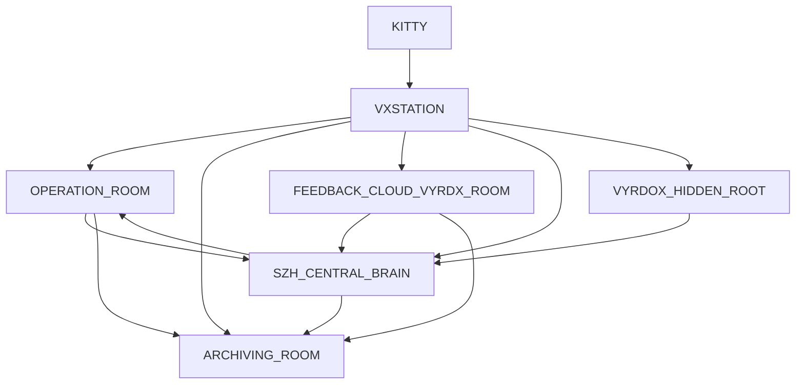

# VXSTATION Room Contract

This document locks the canonical room structure inside `VXSTATION`.

`VXSTATION` in this contract is the system identity inside `KITTY`, not a separate folder root.

## Machine Roles

- `ASUS` = authority machine
- `VXSTATION` = local Kitty control surface
- `VYRDX` = cloud/runtime terminal boundary
- `VYRDOX` = hidden intelligence module

## Canonical Rooms

From this point, the inside of `VXSTATION` is exactly:

1. `OPERATION_ROOM`
2. `ARCHIVING_ROOM`
3. `FEEDBACK_CLOUD_VYRDX_ROOM`
4. `SZH_CENTRAL_BRAIN`
5. `VYRDOX_HIDDEN_ROOT`

No replacement. No expansion. No alternate room naming.

## Room Roles

### `OPERATION_ROOM`

- live control surface
- runtime status
- operator actions
- execution monitoring
- evidence-linked room state

### `ARCHIVING_ROOM`

- frozen records
- change history
- baselines
- signed logs
- rollback reference state

### `FEEDBACK_CLOUD_VYRDX_ROOM`

- cloud feedback intake
- feedback processing
- signal aggregation
- AI/service response layer
- VYRDX-facing feedback outputs

### `SZH_CENTRAL_BRAIN`

- orchestration logic
- policy routing
- state synthesis
- cross-room coordination
- decision support

### `VYRDOX_HIDDEN_ROOT`

- hidden intelligence root
- internal reasoning domain
- sealed mappings
- private system logic
- non-public root layer

## Shared Backbone Rule

Operational room state uses the common backbone:

- `*_summary`
- `*_status_reasons`
- `*_change_events`
- `*_actions`

Evidence linkage is mandatory for state changes and command flow.

## Canonical Diagram

## Terminal Maintenance Contract

The terminal maintenance surface is locked to three rooms:

- `ai_room`
- `vyrdon`
- `media_room`

These are maintenance/control lanes. They are not additional VXSTATION canonical rooms and they are not sealed as top-level KITTY roots on disk today.
